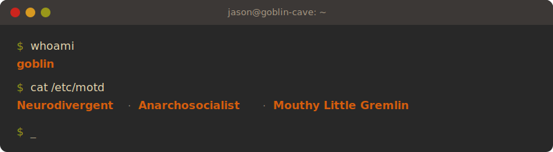

<!-- |========| Header |========| -->

---

<!-- |========| Xxx |========| -->
<!-- \--------\ Xxx \--------\ -->

<h2 align="center">Dev Profile API</h2>

<strong>./src/index.ts</strong>

<code align="left"><pre>
import { describe } from "./utils/getProfile";
import { stack } from "../db/facts";

const jason = { name: "Jason" } as const;
const profile = describe(jason);

console.log(profile.species);  // "goblin"
console.log(profile.desc);     // "neurodivergent anarchosocialist goblin"
console.log(stack);            // ["svelte", "deno", "claude", "ink"]
</pre></code>

<strong>./src/utils/getProfile.ts</strong>

<code align="left"><pre>
import { roles } from "../../db/facts";
import type { Profile } from "../lib/types";

function isJason(name: string): name is "Jason" {
  return name === "Jason";
}

export function describe(user: { name: "Jason" }): Profile&lt;"goblin"&gt;;
export function describe(user: { name: string }): Profile&lt;"human"&gt;;
export function describe(user: { name: string }): Profile {
  if (isJason(user.name)) {
    return {
      name: user.name,
      species: "goblin",
      desc: "neurodivergent anarchosocialist goblin",
      roles: roles.jason,
    };
  }

  return {
    name: user.name,
    species: "human",
    desc: ["pro", "fullstack", "dev"].join(" "),
    roles: roles.default,
  };
}
</pre></code>

<strong>./src/lib/types.d.ts</strong>

<code align="left"><pre>
type Species = "human" | "goblin";

type Adjective = "pro" | "fullstack" | "neurodivergent" | "anarchosocialist";
type Noun = "dev" | "goblin";
type Tag = `${Adjective} ${Noun}`;

interface Role {
  readonly org: string;
  readonly role: string;
  readonly level?: string;
  readonly from: string;
  readonly to?: string;
}

interface Profile&lt;S extends Species = "human"&gt; {
  readonly name: string;
  readonly species: S;
  readonly desc: S extends "goblin"
    ? "neurodivergent anarchosocialist goblin"
    : string;
  readonly roles: readonly Role[];
}
</pre></code>

<strong>./db/facts.ts</strong>

<code align="left"><pre>
export const stack = [
  "svelte", "deno", "claude", "ink",
] as const satisfies readonly string[];

export const roles = {
  default: [
    { org: "@techStartUp", role: "innovation engineer" },
  ],
  jason: [
    { org: "@foundersandcoders", role: "apprentice dev", level: "mid/senior (shhh)", from: "2025" },
    { org: "@foundersandcoders", role: "L6 AI apprenticeship mentor", from: "2025" },
    { org: "@FAC-31", role: "facilitator", from: "2025-02", to: "2025-07" },
    { org: "@foundersandcoders", role: "dev", from: "2024-09", to: "2025" },
    { org: "@fac30", role: "grad", from: "2024-09", to: "2024-12" },
    { org: "@FAC29A", role: "grad", from: "2023-09", to: "2023-11" },
  ],
} as const;
</pre></code>

---

<h2 align="center">The Debris Left in My Wake</h2>

<strong>On Fire Right Now</strong>

<table align="left">
<tr>
<th></th>
<th>Name</th>
<th>Description</th>
<th>Links</th>
</tr>
<tr>
<td>🏗️</td>
<td><strong>FAC Internal Platform</strong></td>
<td>the internal engine that keeps Founders and Coders running — API, apps & workers — with <a href="https://github.com/Jaz-spec">@Jaz-spec</a>, <a href="https://github.com/izaakrogan">@izaakrogan</a> & <a href="https://github.com/sofer">@sofer</a></td>
<td></td>
</tr>
<tr>
<td>✒️</td>
<td><strong>The Work</strong></td>
<td>write a thesis in one night whilst staving off existential angst</td>
<td><a href="https://github.com/JasonWarrenUK/the-work">repo</a></td>
</tr>
<tr>
<td>👹</td>
<td><strong>Goblin Mode</strong></td>
<td>commands, skills, hooks, agents & output styles for Claude Code</td>
<td><a href="https://github.com/JasonWarrenUK/goblin-mode">repo</a></td>
</tr>
<tr>
<td>🏛️</td>
<td><strong>Those Who Came Before</strong></td>
<td>try to understand a vanished culture by interpreting procedurally generated artefacts</td>
<td><a href="https://github.com/JasonWarrenUK/those-who-came-before">repo</a></td>
</tr>
</table>

<strong>Receipts</strong>

<table align="left">
<tr>
<th>Name</th>
<th>Description</th>
<th>Team</th>
<th>Year</th>
<th>Links</th>
</tr>
<tr>
<td><strong>Iris</strong></td>
<td>turn messy learner CSVs into validated ILR submissions that the ESFA will actually accept</td>
<td><a href="https://github.com/Jaz-spec">@Jaz-spec</a>, Izaak & Dan</td>
<td>2026</td>
<td><a href="https://github.com/foundersandcoders/iris">repo</a></td>
</tr>
<tr>
<td><strong>Workwise</strong></td>
<td>turn static accessibility surveys into dynamic evolving conversations</td>
<td><a href="https://github.com/AlexVOiceover">@AlexVOiceover</a></td>
<td>2025</td>
<td><a href="https://github.com/foundersandcoders/workwise">repo</a></td>
</tr>
<tr>
<td><strong>Things We Do</strong></td>
<td>track your mood & build a personal toolkit for getting through the day</td>
<td><a href="https://github.com/jackcasstlesjones">@jackcasstlesjones</a>, <a href="https://github.com/maxitect">@maxitect</a> & <a href="https://github.com/gurtatiLND">@gurtatiLND</a></td>
<td>2024</td>
<td><a href="https://github.com/fac30/things-we-do">repo</a></td>
</tr>
<tr>
<td><strong>Sakura</strong></td>
<td>a colour palette app where you can ask for "dark reddish purple" & it knows what you mean</td>
<td><a href="https://github.com/jackcasstlesjones">@jackcasstlesjones</a> & <a href="https://github.com/JoshCodedit">@JoshCodedit</a></td>
<td>2024</td>
<td><a href="https://github.com/fac30/sakura-api">server</a> / <a href="https://github.com/fac30/sakura-front">client</a></td>
</tr>
</table>

<strong>Unreplied Texts</strong>

<table align="left">
<tr>
<th></th>
<th>Name</th>
<th>Description</th>
<th>Links</th>
</tr>
<tr>
<td>🍞</td>
<td><strong>Bag of Bread</strong></td>
<td>crumbs and nuggets for the Hovis-inclined</td>
<td><a href="https://github.com/JasonWarrenUK/Bag-of-Bread">repo</a></td>
</tr>
<tr>
<td>🔮</td>
<td><strong>Sparker</strong></td>
<td>track observations about SEN students over time & surface the patterns a facilitator might miss</td>
<td><a href="https://github.com/JasonWarrenUK/sparker">repo</a></td>
</tr>
<tr>
<td>⏳</td>
<td><strong>Grand Chronicle</strong></td>
<td>taking someone who witnessed a historical event & see what else they lived through</td>
<td><a href="https://github.com/JasonWarrenUK/grand-chronicle">repo</a></td>
</tr>
<tr>
<td>🗑️</td>
<td><strong>Pretty Vacancies</strong></td>
<td>(1) ridiculous amount of work now (2) small convenience later</td>
<td><a href="https://github.com/JasonWarrenUK/pretty-vacancies">repo</a></td>
</tr>
<tr>
<td>🔬</td>
<td><strong>Prism</strong></td>
<td>map the tangled web of learners, facilitators & projects so the right learning finds the right person</td>
<td><a href="https://github.com/foundersandcoders/prism">repo</a></td>
</tr>
</table>

<strong>Pinned Tabs</strong>

<table align="left">
<tr>
<th></th>
<th>Name</th>
<th>Description</th>
<th>Links</th>
</tr>
<tr>
<td>🤖</td>
<td><strong>Rhea</strong></td>
<td>an LLM-powered assistant for democratic/peer-led learning cohorts</td>
<td><a href="https://github.com/foundersandcoders/rhea">repo</a></td>
</tr>
<tr>
<td>💭</td>
<td><strong>Inconsequential Thinking</strong></td>
<td>an MCP server that watches Claude think & suggests slash commands along the way</td>
<td><a href="https://github.com/JasonWarrenUK/inconsequential-thinking">repo</a></td>
</tr>
<tr>
<td>🧵</td>
<td><strong>Beacons</strong></td>
<td>turn freeform journaling into a graph you can actually navigate & act on</td>
<td><a href="https://github.com/foundersandcoders/beacons-backend">server</a> / <a href="https://github.com/foundersandcoders/beacons-frontend-v2">client</a></td>
</tr>
</table>

<strong>Odd Socks</strong>

<table align="left">
<tr>
<th>Name</th>
<th>Links</th>
<th>Team</th>
<th>Year</th>
</tr>
<tr>
<td><strong>Rimewarden</strong></td>
<td><a href="https://github.com/JasonWarrenUK/rimewarden">repo</a></td>
<td></td>
<td>2026</td>
</tr>
<tr>
<td><strong>Sith Maker</strong></td>
<td><a href="https://github.com/JasonWarrenUK/sith-maker">repo</a></td>
<td></td>
<td>2026</td>
</tr>
<tr>
<td><strong>Nihilistic Onboarder</strong></td>
<td><a href="https://github.com/JasonWarrenUK/nihilistic-onboarder">repo</a></td>
<td></td>
<td>2025</td>
</tr>
<tr>
<td><strong>Hat Recommender</strong></td>
<td><a href="https://github.com/JasonWarrenUK/telebrain">repo</a></td>
<td></td>
<td>2025</td>
</tr>
<tr>
<td><strong>Psyche</strong></td>
<td><a href="https://github.com/fac-31/psyche">repo</a></td>
<td><a href="https://github.com/Jaz-spec">@Jaz-spec</a></td>
<td>2025</td>
</tr>
<tr>
<td><strong>Commons Traybake</strong></td>
<td><a href="https://github.com/fac-31/commons-traybake">repo</a></td>
<td><a href="https://github.com/Jaz-spec">@Jaz-spec</a>, <a href="https://github.com/nchua3012">@nchua3012</a> & <a href="https://github.com/JosephPotashnik">@JosephPotashnik</a></td>
<td>2025</td>
</tr>
<tr>
<td><strong>ReDoT</strong></td>
<td><a href="https://github.com/fac-31/ReDoT">repo</a></td>
<td><a href="https://github.com/JosephPotashnik">@JosephPotashnik</a> & <a href="https://github.com/FortyTwoFortyTwo">@FortyTwoFortyTwo</a></td>
<td>2025</td>
</tr>
<tr>
<td><strong>The Forgotten One</strong></td>
<td><a href="https://github.com/JasonWarrenUK/the-forgotten-one">repo</a></td>
<td></td>
<td>2025</td>
</tr>
<tr>
<td><strong>Petulant God</strong></td>
<td><a href="https://github.com/JasonWarrenUK/petulant-god">repo</a></td>
<td></td>
<td>2023</td>
</tr>
<tr>
<td><strong>Melonhead</strong></td>
<td><a href="https://neurosocialist.itch.io/melonhead">itch.io</a></td>
<td></td>
<td>2022</td>
</tr>
<tr>
<td><strong>Prisms</strong></td>
<td><a href="https://neurosocialist.itch.io/prisms">itch.io</a> / <a href="https://github.com/JasonWarrenUK/prism">repo</a></td>
<td></td>
<td>2021</td>
</tr>
<tr>
<td><strong>My Brothers, Counting</strong></td>
<td><a href="https://neurosocialist.itch.io/brothers-trying-to-count">itch.io</a></td>
<td></td>
<td>2020</td>
</tr>
</table>

<strong>Cursed Tupperware</strong>

<table align="left">
<tr>
<th>Name</th>
<th>Links</th>
</tr>
<tr>
<td><strong>Got My Back</strong></td>
<td><a href="https://github.com/JasonWarrenUK/got-my-back">repo</a></td>
</tr>
<tr>
<td><strong>Knowledge Kata</strong></td>
<td><a href="https://github.com/JasonWarrenUK/knowledge-kata">repo</a></td>
</tr>
</table>

---

<h2 align="center">Recent Mischief</h2>

<!--START_SECTION:activity-->
1. 🎉 Merged PR [#21](https://github.com/JasonWarrenUK/wyrd/pull/21) in [JasonWarrenUK/wyrd](https://github.com/JasonWarrenUK/wyrd)
2. 🎉 Merged PR [#23](https://github.com/JasonWarrenUK/wyrd/pull/23) in [JasonWarrenUK/wyrd](https://github.com/JasonWarrenUK/wyrd)
3. 🎉 Merged PR [#26](https://github.com/JasonWarrenUK/wyrd/pull/26) in [JasonWarrenUK/wyrd](https://github.com/JasonWarrenUK/wyrd)
4. 🎉 Merged PR [#20](https://github.com/JasonWarrenUK/wyrd/pull/20) in [JasonWarrenUK/wyrd](https://github.com/JasonWarrenUK/wyrd)
5. 🎉 Merged PR [#1](https://github.com/JasonWarrenUK/lyra-rose/pull/1) in [JasonWarrenUK/lyra-rose](https://github.com/JasonWarrenUK/lyra-rose)
<!--END_SECTION:activity-->

---

<h2 align="center">Hit Me Up</h2>

&nbsp;

&nbsp;

---

<h2 align="center">Field Guide to Jason</h2>

<strong>How Does It Behave?</strong>

<h4 align="left"><s>I Need Help</s>Collaboration Opportunities</h4>

<ul>
<li>I'm looking to collaborate on <strong>useless-yet-interesting linguistics utilities & neurodivergent revolutionary digital infrastructure</strong></li>
<li>I'm looking for help with <strong>basic life skills</strong></li>
</ul>

<h4 align="left">Past Lives</h4>

<ul>
<li>Also I started by bimbling about with <a href="https://neurosocialist.itch.io/">ink stories</a></li>
<li>I wroted a book: <a href="https://amazon.co.uk/Creating-Worlds-Immersive-Theatre-Making/dp/1848424450">here it is</a></li>
</ul>

<h4 align="left">Trivia</h4>

<ul>
<li>Ask me about <strong>arts pedagogy & interactive narrative</strong></li>
<li>How to reach me: <strong><s>gently, and with a kind smile</s> jason@foundersandcoders.com</strong></li>
<li>Fun Fact: <strong>There is no ethical consumption under late-stage capitalism</strong></li>
</ul>

<strong>What Is It Doing?</strong>

I'm currently seriously learning about...

<ul>
<li><strong>Claude Code</strong> (<em>deep customisation & power-user workflows: hooks, skills, agents, output styles</em>)</li>
<li><strong>Shell scripting</strong> & <strong>terminal customisation</strong></li>
<li><strong>Tauri</strong></li>
<li><strong>PostgreSQL</strong></li>
<li><strong>Bun</strong></li>
</ul>

I'm also dabbling with...

<ul>
<li><strong>OpenTUI</strong></li>
<li><strong>D3</strong></li>
<li><strong>Docker</strong> & <strong>Kubernetes</strong></li>
</ul>

---

<h2 align="center">is rl dev, look</h2>

 

 

<footer>
</footer>
